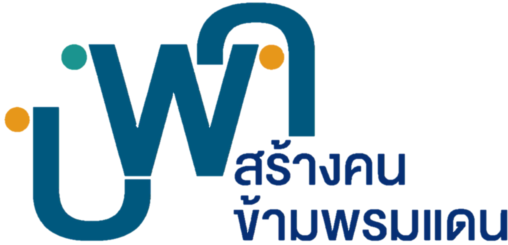
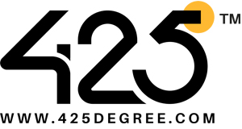
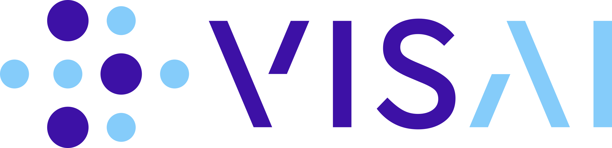
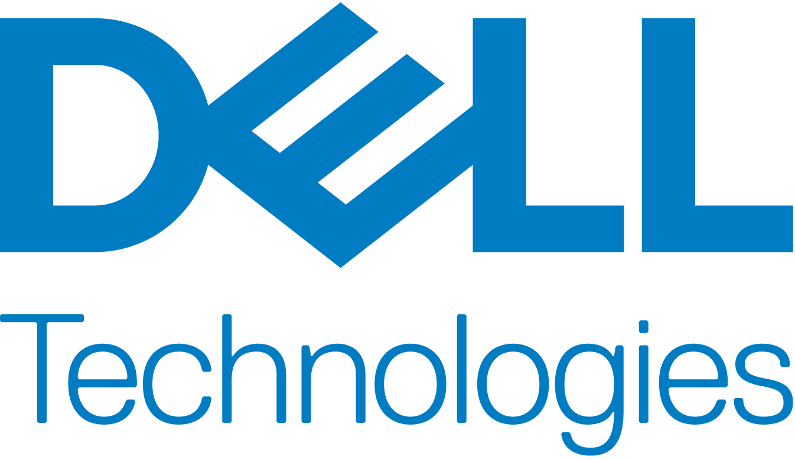
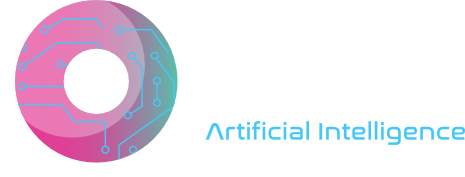
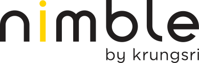
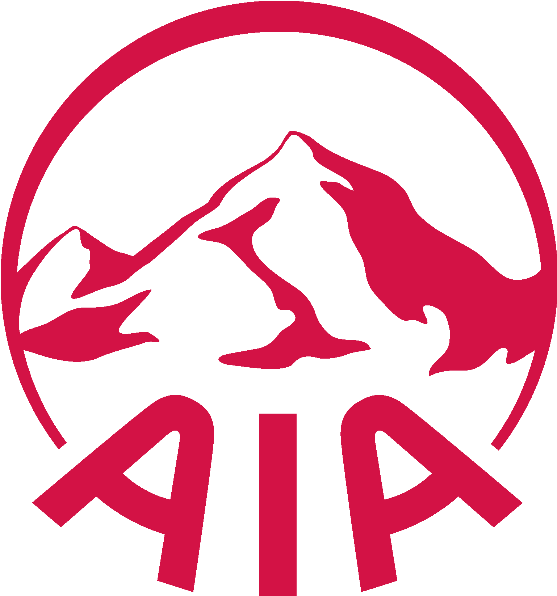

   
  
   

<h3 align="center">
  
a program for kids who want to build good AI

</h3>

โครงการสำหรับน้องๆมัธยมต้น-ปลาย ที่สนใจสร้างผลงานโดยใช้เทคนิคทางด้านวิทยาศาสตร์ข้อมูล (Data Science)
และปัญญาประดิษฐ์ (Artificial Intelligence)

AI Builders เป็นโครงการสำหรับน้องๆมัธยมต้น-ปลาย ที่สนใจสร้างผลงานโดยใช้เทคนิคทางด้านวิทยาศาสตร์ข้อมูล (Data Science)
และปัญญาประดิษฐ์ (Artificial Intelligence)

โครงการ AI Builders ก่อตั้งขึ้นในปี 2021 จากความร่วมมือระหว่าง VISTEC/VISAI และ Central Retail Digital เพื่อพัฒนาองค์ความรู้ทางด้านวิทยาศาสตร์ข้อมูล (Data Science) และปัญญาประดิษฐ์ (Artificial Intelligence / AI) ให้กับน้องๆระดับมัธยมต้น-ปลาย ที่สนใจอยากเรียนรู้และพัฒนาโครงงานที่ใช้ทักษะในด้านนี้เพื่อประยุกต์ใช้จริงในชีวิตประจำวัน

ผู้สนับสนุน 2024: PMU-B, AWS, Central Retail Digital และ 425 Degree

ผู้สนับสนุน 2023: PMU-B, AWS, DELL, OSKAI, VISAI, Krungsri Nimble

ผู้สนับสนุน 2022: VISAI, Krungsri Nimble, AWS, AIA, DELL และ Central Digital

ทีมงานผู้จัด: VISAI, Cengral Digital, Mahidol University

Facebook Page: [AI Builders](https://www.facebook.com/aibuildersx)

## Our Sponsors

### AI Builders 2024

  

      
      
      
      
      
  

### AI Builders 2023

  

      
      
      
      
      
      
     
  

### AI Builders 2022

  

    
    
    
    
    
  

   
  

    
    
  

## Dependencies

- [Pytorch](https://pytorch.org/)
- [fastai](https://github.com/fastai/fastai)

## เว็บไซต์ (Website)

หน้าเว็บไซต์ของโครงการอยู่ในโฟลเดอร์ `docs` และหน้าสรุปเนื้อหาของแต่ละโพสต์จะอยู่ใน `docs/_posts/`
น้องๆหรือผู้ที่อยากเข้ามาแก้ไขเนื้อหาสามารถ fork repository นี้และส่ง [pull request](https://github.com/vistec-AI/ai-builders/pulls)
เพื่อแก้ไขเนื้อหา โดยหน้าหลักของเว็บไซต์จะอยู่ในไฟล์

- เกี่ยวกับเรา `about.md`
- หน้าลงทะเบียน `register.md`
- ข้อพึงปฏิบัติ `code-of-conduct.md`
- บทความ `blog.md`
