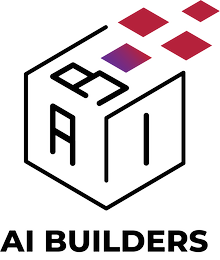
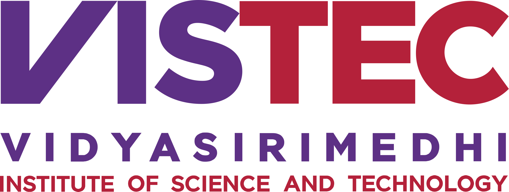
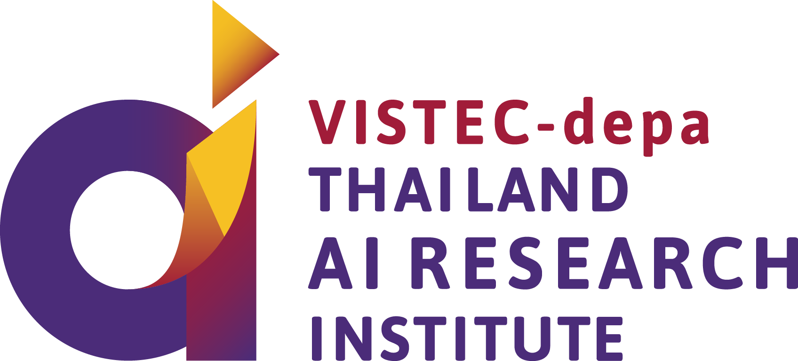

   
  
   

<h3 align="center">
  
a program for kids who want to build good AI

</h3>

โครงการสำหรับน้องๆมัธยมต้น-ปลาย ที่สนใจสร้างผลงานโดยใช้เทคนิคทางด้านวิทยาศาสตร์ข้อมูล (Data Science)
และปัญญาประดิษฐ์ (Artificial Intelligence)

โครงการ AI Builders ก่อตั้งขึ้นจากความร่วมมือระหว่าง VISTEC / AI Research และ
Central Group เพื่อพัฒนาองค์ความรู้ทางด้านวิทยาศาสตร์ข้อมูล (Data Science) และปัญญาประดิษฐ์
(Artificial Intelligence / AI) ให้กับน้องๆระดับมัธยมต้น-ปลาย
ที่สนใจอยากเรียนรู้และพัฒนาโครงงานที่ใช้ทักษะในด้านนี้เพื่อประยุกต์ใช้จริงในชีวิตประจำวัน

## ตารางเรียน

เราใช้การเรียนการสอนจาก Fast AI ร่วมกับการทำโปรเจกต์ควบคู่กันไป โดยน้องๆสามารถติดตามการเรียนการสอนได้ดังนี้

| Week | Lecture                                                     | Project            |
|------|-------------------------------------------------------------|--------------------|
| 0    | Pre-class: ติดตั้ง Python และทดลองใช้ Google Colab              | Intro              |
| 1    | [Fast AI Lesson 1](https://course.fast.ai/videos/?lesson=1) | Question, Dataset  |
| 2    | [Fast AI Lesson 2](https://course.fast.ai/videos/?lesson=2) | Explore dataset    |
| 3    | [Fast AI Lesson 3](https://course.fast.ai/videos/?lesson=3) | Working on project |
| 4    | [Fast AI Lesson 4](https://course.fast.ai/videos/?lesson=4) | Working on project |
| 5    | [Fast AI Lesson 5](https://course.fast.ai/videos/?lesson=5) | Working on project |
| 6    | [Fast AI Lesson 6](https://course.fast.ai/videos/?lesson=6) | Working on project |
| 7    | [Fast AI Lesson 7](https://course.fast.ai/videos/?lesson=7) | Working on project |
| 8    | [Fast AI Lesson 8](https://course.fast.ai/videos/?lesson=8) | Working on project |
| 9    | No lecture                                                  | Presentation       |

## Dependecies

* [Pytorch](https://pytorch.org/)
* [fastai](https://github.com/fastai/fastai)

## เว็บไซต์ (Website)

หน้าเว็บไซต์ของโครงการอยู่ในโฟลเดอร์ `docs` และหน้าสรุปเนื้อหาของแต่ละโพสต์จะอยู่ใน `docs/_posts/`
น้องๆหรือผู้ที่อยากเข้ามาแก้ไขเนื้อหาสามารถ fork repository นี้และส่ง [pull request](https://github.com/vistec-AI/ai-builders/pulls)
เพื่อแก้ไขเนื้อหา โดยหน้าหลักของเว็บไซต์จะอยู่ในไฟล์

* เกี่ยวกับเรา `about.md`
* หน้าลงทะเบียน `register.md`
* ข้อพึงปฏิบัติ `code-of-conduct.md`
* บทความ `blog.md`

## Organizers

* VISTEC
* Central

  
  
  
  

